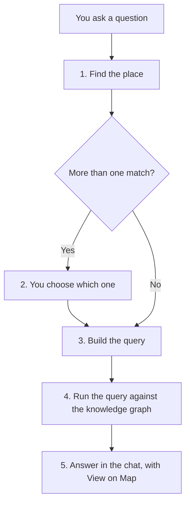

# How Kaleidoscope answers a question

When you ask a question, Kaleidoscope's AI works through the steps below. Knowing them explains why Kaleidoscope sometimes asks you to choose between places, and why its answers can be traced back to the data.

1. **Find the place.** Kaleidoscope looks up the place or object you named in the knowledge graph, by its name or code.
2. **Confirm, if needed.** If several objects match, Kaleidoscope lists them and asks which one you meant. Click **View Options** to choose one from a map and table, or reply with its code.
3. **Build the query.** The AI writes a query in SPARQL, using the types of objects and relationships in the knowledge graph.
4. **Run the query.** The query runs against the published graph and returns up to 100 results.
5. **Answer.** Kaleidoscope writes its answer in the chat. If the answer came from a query, it usually also shows a **View on Map** button. Objects named in the answer are links: click one to open its details.

## Why the query is constrained

The AI is given the types of objects and relationships that exist in the knowledge graph. It's told to use only those, and not to make up data. This keeps answers tied to records that actually exist.

It doesn't make the AI infallible. The AI writes the query from your wording, so an unclear question can produce a query that answers something slightly different from what you meant. If an answer looks wrong, rephrase the question, or say exactly which relationship you mean, such as "located in the project area" or "at risk of flooding in the No Mitigation Scenario".

## Seeing how an answer was worked out

For answers that involve a calculation, such as a total or a comparison, Kaleidoscope may show a **Reasoning** label above the answer. Hover over it to see how the AI worked the answer out. Kaleidoscope decides when to include it. You can't turn it on or off.

## What View on Map does

When you click **View on Map**, Kaleidoscope writes a new query from your conversation so far, to find the objects behind the answer. It shows them on the map and in the results table, grouped by type. Because this is a second query, check that the mapped results match what the chat answer described.

**Back to chat** returns you to the conversation, and **Save Query** saves the query behind the map, so you can map its results again later from the **Saved Queries** tab. See [Saving a query](../user-guide/saving-a-query.md). The **Layers** legend lists each type of object on the map. The arrow at the bottom of the map opens the results table.

Click an object on the map to see its details in a popup: its label, code, type and attributes. **Inspect** opens the object in the inspector, where you can also see how it's connected to other objects. See [Inspecting an object](../user-guide/inspecting-an-object.md) and [Exploring connections](../user-guide/exploring-connections.md).

## Follow-up questions

Kaleidoscope remembers the earlier messages in a conversation. You can ask a follow-up, such as "What about in the Combo Plan Scenario?", without repeating the rest of the question. To start again without that context, click **New chat** at the bottom of the sidebar. This opens a new conversation. See [Managing conversations](../user-guide/managing-conversations.md).
