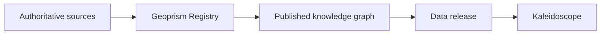

# Where the data comes from

Kaleidoscope doesn't create or edit data. It answers questions from data that comes from authoritative sources and is published by [Geoprism Registry](geoprism-registry.md). Every answer comes from a query against that data.

## How data reaches Kaleidoscope

1. **Authoritative sources publish data.** USACE and other organizations are the authoritative sources for datasets such as structures, land parcels, roads, creeks and flood scenarios.
2. **Geoprism Registry translates it into a knowledge graph.** The data is [loaded into Geoprism Registry](https://docs.geoprismregistry.com/version/v2.0.0/curate), which adds relationships, persistent codes, change over time, controlled vocabularies and provenance.
3. **Geoprism Registry publishes the knowledge graph.** The published graph holds the records and the relationships between them.
4. **A data release delivers it to Kaleidoscope.** New and updated data reaches Kaleidoscope in [data releases](data-releases.md).
5. **Kaleidoscope queries the graph.** Each question is answered with a query against the published graph. See [How Kaleidoscope answers a question](../concepts/how-kaleidoscope-answers.md).

## In this section

| Page | What it covers |
| ---- | -------------- |
| [How Geoprism Registry prepares the data](geoprism-registry.md) | How Geoprism Registry turns data from authoritative sources into a knowledge graph, and the Geoprism Registry concepts you'll see in Kaleidoscope. |
| [Data releases](data-releases.md) | How new and updated data reaches Kaleidoscope. |
