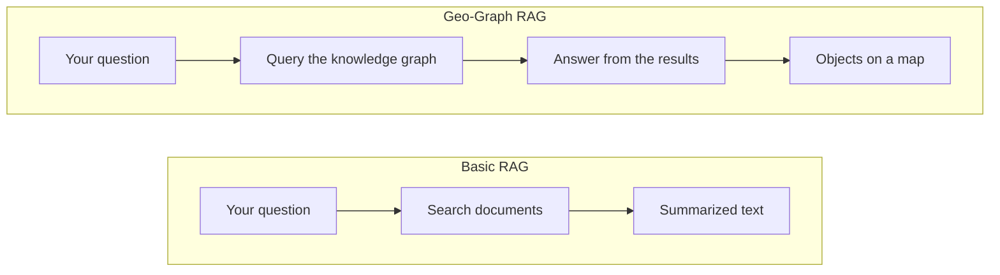

# Why Geo-Graph RAG

Kaleidoscope is built on an approach called **Geo-Graph RAG**. This page explains what that means, and why it gives you answers you can check.

## The problem with general AI chat tools

General AI chat tools answer from patterns in the text they were trained on. They can write a convincing paragraph about flood risk, but they can't reliably tell you which buildings are at risk in a specific flood scenario. They don't have an authoritative, current record of where those buildings are and which scenarios put them at risk, so when they don't know, they may guess.

## What RAG adds

**Retrieval-augmented generation** (RAG) means the AI looks up relevant information before it answers, instead of relying on what it remembers.

## What basic RAG misses

Most RAG tools look up passages of text, such as paragraphs from reports and web pages. Text might mention that a building is near a creek, but it doesn't reliably record which areas contain which places, what's next to what, or how infrastructure connects. A text-based tool can only summarize what the passages it found happen to say.

## What Geo-Graph RAG adds

Kaleidoscope looks up information in a **spatial knowledge graph** instead of in documents. A knowledge graph stores things, and the relationships between them, as structured data. A spatial knowledge graph also stores where each thing is.

* **Answers come from structured data.** Kaleidoscope answers from a knowledge graph of places, infrastructure and related records published by [Geoprism Registry](https://docs.geoprismregistry.com/version/v2.0.0/introduction), not from loose documents.
* **Every place is a real, identified record.** Each structure, road or land parcel in the graph is a record from an authoritative source, with a [code](https://docs.geoprismregistry.com/version/v2.0.0/geoprism-registry-key-components/content-related-capacities-of-geoprism-registry/5.2-content-related-capacities-of-geoprism-registry-1) that identifies it.
* **Relationships are explicit.** The graph records connections such as "is located in", "flows into", "is at risk of flooding in" and "is mitigated by", so Kaleidoscope doesn't have to work them out from text.
* **The AI writes a precise query.** Kaleidoscope turns your question into a query in SPARQL, a standard language for querying knowledge graphs, and runs it against the graph. The answer is built from the query's results, such as a list of structures or a total population, not paraphrased from text.

Because the answer comes from a query, the same query against the same data always returns the same results. The AI writes the query from your wording, though, so rephrasing a question can produce a different query. If an answer looks wrong, try asking the question another way.

## Basic RAG and Geo-Graph RAG compared

| | Basic RAG | Geo-Graph RAG |
| - | --------- | ------------- |
| Where answers come from | Passages of text from documents. | A knowledge graph of identified records from authoritative sources. |
| Spatial awareness | Only what the text happens to say about location. | Each place is stored with its location, so answers can be shown on a map. |
| Relationships | Implied in the text, if they're mentioned at all. | Stored explicitly, such as "is located in" or "is at risk of flooding in". |
| Traceability | At best, a pointer to the passage used. | Each result is a record with a code you can trace to its source. |
| Repeatability | The summary can change each time you ask. | The same query against the same data returns the same results. |

To see the steps Kaleidoscope takes to answer a question, see [How Kaleidoscope answers a question](../concepts/how-kaleidoscope-answers.md).
